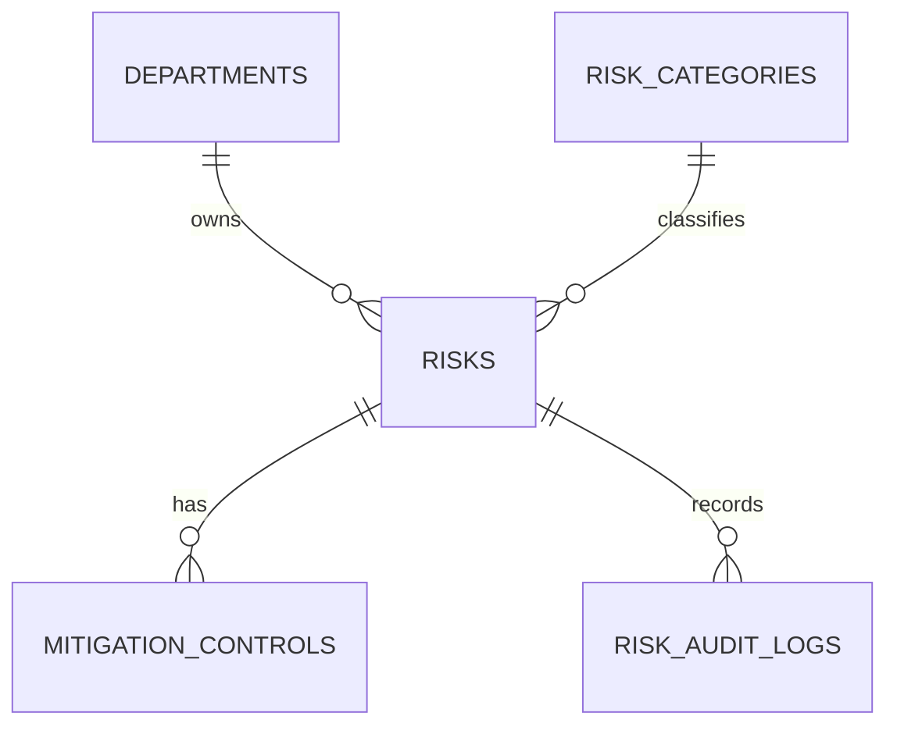

# ER Diagram

```mermaid
erDiagram
  DEPARTMENTS ||--o{ RISKS : owns
  RISK_CATEGORIES ||--o{ RISKS : classifies
  RISKS ||--o{ MITIGATION_CONTROLS : has
  RISKS ||--o{ RISK_AUDIT_LOGS : records
```

A department owns many risks; each risk belongs to one department and one category. Each risk can have many mitigation controls and audit events.
